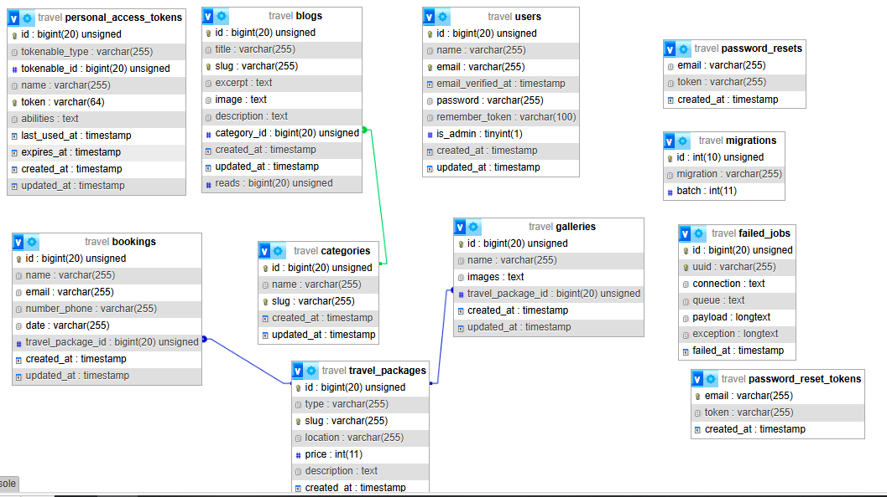
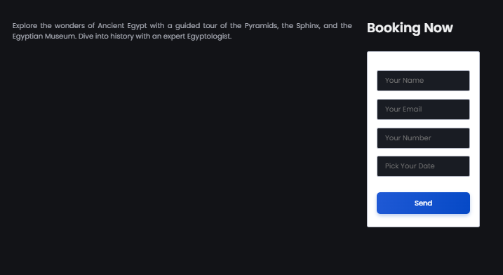
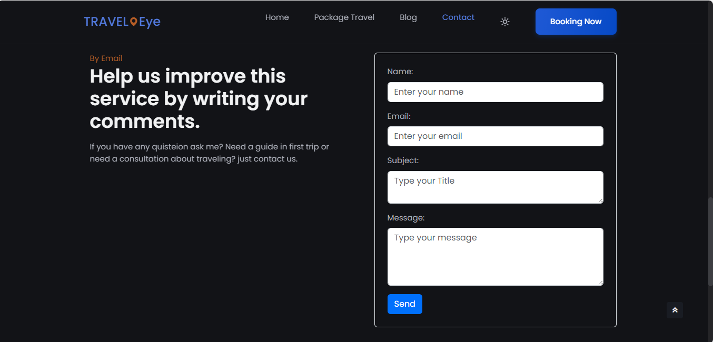
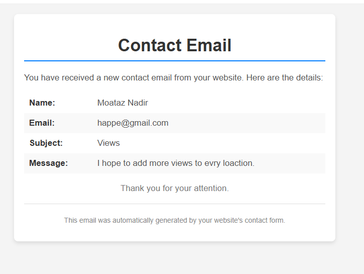
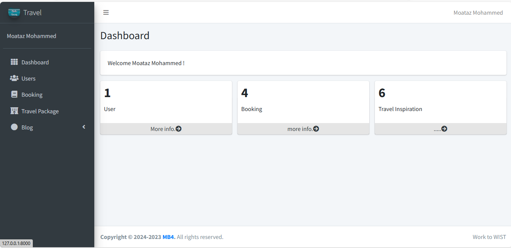
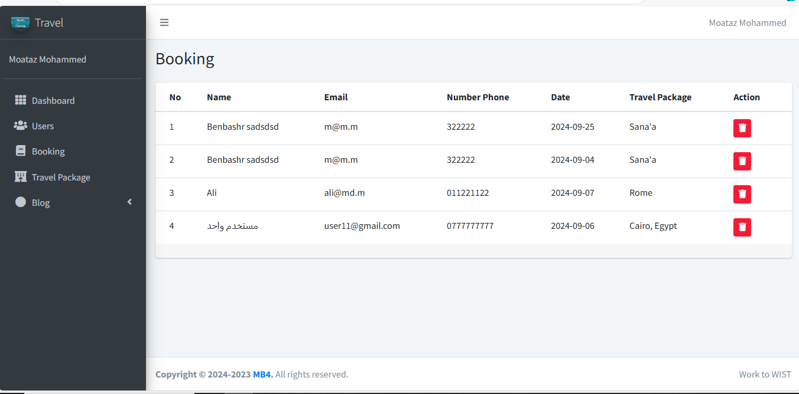
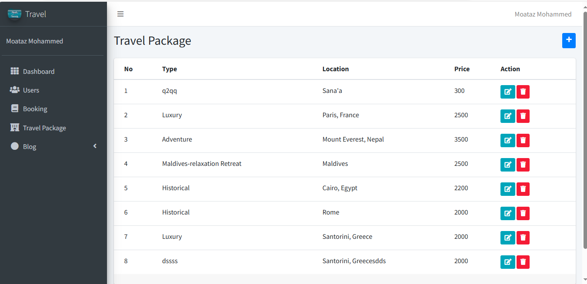
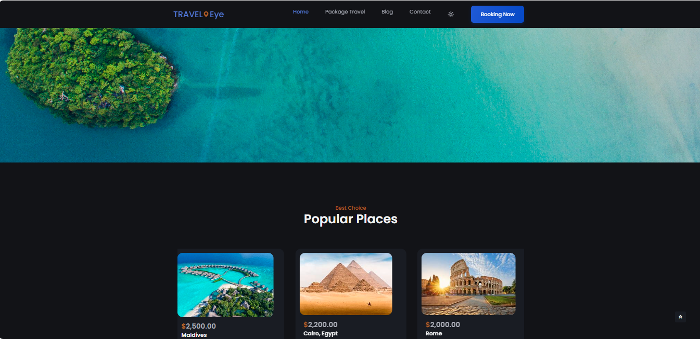

# Simple Travel Website
## Database


## Installing

### Download Project On Your PC
- Download from github as ZIP file.
- Download by : 
    ```bash
        git clone path
    ```
### Go to the project directory
```bash
    cp .env.example .env
```

```bash
    composer install
```

```bash
    npm install
```


```bash
   npm audit fix --force    
```


```bash
     php artisn serv      
```


```bash
   npm run dev
```

```bash
    php artisan key:generate
```

```bash
    php artisan artisan migrate:fresh --seed
```

```bash
    php artisan storage:link
```

### Login

-   email = admin@admin.com
-   password = 123123123

## Main Screen
### Booking 

- I use The Form To Send Booking.and I Use What's Up Api For Booking Now.
### Contact Us

- To Send the User Feedback or Tips for the website developed.Or to Send for any quisetion.
- The admin will receve the 
email from the user.I use <a target="_blank" href="https://mailtrap.io/"> **Mailtrap** </a> site to Test Email.
<a target="_blank" href="https://www.youtube.com/watch?v=FvsSZkRf7IM">  **(Video explain Mailtrap here)**</a> 


### Dashboard


- I use Simple dashbooard to manage and  controll the table in database.
- I use it to display card to give simple reader about table.
- Another Photo :Booking & Travel Package



### FrontScreen
- The Home Screen Second Section.


